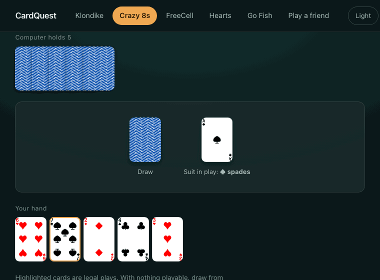
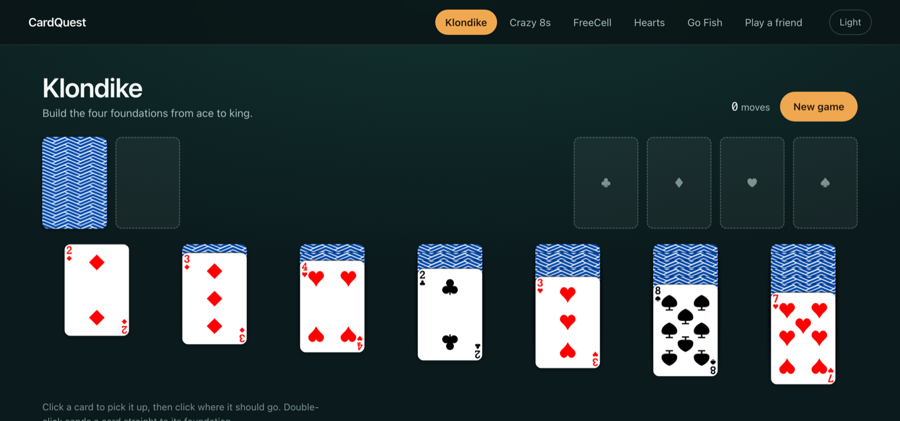
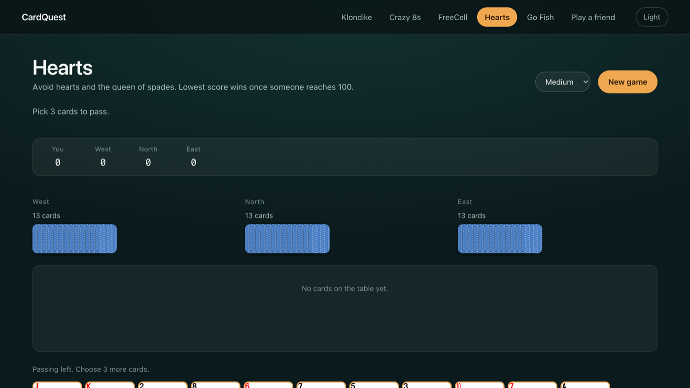

# CardQuest

Five card games that run entirely in the browser. No install, no account, no
backend, and no server keeping score.



*A real game of Crazy 8s against the computer. Nothing here is staged: the frames
are captured from the running app.*

**[Play it here](https://agoel21.github.io/CardQuest/)**



## The games

| Game | Players | Notes |
|---|---|---|
| **Klondike** | Solo | Standard patience. Win and dead-end detection. |
| **FreeCell** | Solo | Every card face up. Four free cells, no hidden luck. |
| **Crazy 8s** | vs computer | Eights are wild and you nominate the suit. |
| **Go Fish** | vs computer | The opponent remembers which ranks you ask for. |
| **Hearts** | vs 3 computers | Passing rotation, the queen of spades, shooting the moon. |
| **Play a friend** | Two machines | Crazy 8s over a direct browser-to-browser link. |



## Running it

```bash
npm install
npm run dev
```

Then open the URL it prints. Other commands:

```bash
npm test        # 120 tests
npm run build   # production build into dist/
npm run typecheck
```

Requires Node 18 or newer. There is nothing else to configure: no environment
variables, no database, no API keys.

## Playing

Every game can be played three ways, and all three stay in sync:

- **Drag** a card where you want it. Legal destinations highlight as you drag,
  and an illegal drop returns the card to where it came from.
- **Click** a card to pick it up, then click where it should go.
- **Keyboard**: tab to a card and press Enter. Nothing is drag-only, so the
  games are fully playable without a pointer.

Each game page carries its own rules and instructions, so you do not need to
know a game before opening it.

## How multiplayer works

Two people on different machines play Crazy 8s with no server in the middle.
One side creates a room and reads out a six-character code; the other joins
with it. PeerJS's free broker is used **only** to introduce the two browsers to
each other. Once they are connected, every card travels directly between them
over WebRTC.

The design is **host-authoritative**. The host runs the only real board; the
guest holds a read-only mirror and sends intents rather than moves. This is
what makes a desync structurally impossible rather than merely unlikely, since
there is exactly one copy of the game state. The host checks that it is the
guest's turn, that the guest actually holds the card, and that the play is
legal, so a modified client cannot play out of turn or invent a card.

Snapshots sent to the guest contain the guest's own hand but only a *count* of
the host's, so a guest reading the raw messages in devtools still learns
nothing about what the host is holding. There is a test asserting exactly that.

### What multiplayer cannot do

A direct connection needs at least one side to be reachable through its NAT.
Home networks usually manage this. **Symmetric NATs, common on corporate and
some mobile networks, do not**, and the standard fix is a TURN relay to bounce
traffic through. No provider offers TURN free permanently, and this project has
a hard zero-cost constraint, so there is no relay and no fallback. On a network
that blocks direct connections the game fails with a clear message instead of
hanging or pretending to work.

The host can also, in principle, cheat, because it holds the authoritative
board. Preventing that needs a neutral referee, and a referee needs a server
that is always on, which again cannot be had for free. For two people who chose
to play each other, this seemed the right trade.

## The computer opponents

Opponents only ever choose among moves the board has already declared legal,
and none of them can see another player's hand. Every one is covered by fuzz
tests that play hundreds of complete games and assert that no illegal move is
ever made.

Crazy 8s difficulty is labelled by **playing style rather than strength**, and
that is deliberate. Measured over 1500 seeded games per matchup, with seats
alternated to cancel the first-player advantage:

| Matchup | Win rate |
|---|---|
| Balanced vs Random | 57.3% |
| Defensive vs Random | 57.1% |
| Defensive vs Balanced | 48.6% |

Both competent strategies beat the random one by the same margin and are within
noise of each other, across three separate attempts at making one stronger.
That turns out to be a property of the game: Crazy 8s has no scoring, and every
turn sheds exactly one card whatever you play, so there is very little for skill
to compound on. Shipping a setting called "Hard" that is not measurably harder
would have been dishonest, so the settings describe how the opponent plays,
which is a real difference. Hearts, which has far more room for skill, keeps
easy/medium/hard.

## How it is built

```
src/engine/    Pure game primitives: cards, decks, piles, foundations, seeded RNG
src/games/     One board per game, holding all the rules
src/ai/        Opponents, which only ever pick from board-declared legal moves
src/net/       Transport interface, WebRTC transport, host and guest sessions
src/routes/    One screen per game
src/ui/        Shared card rendering, app shell, theming
```

The engine has no DOM, React or browser imports at all. That is enforced by
design rather than convention: it has to be usable from tests, from the AI
search, and from both sides of a network session.

Shuffling and dealing are **seeded and deterministic**. Both peers must be able
to derive an identical deal from a shared seed, and it makes every game test
reproducible instead of flaky.

## History

This started as a 2023 university group project: an ASP.NET Core app in C# with
a SQL Server backend, built by a team of six. Its own README was refreshingly
honest about the state of it:

> "the front-end is not functional and has no way to access the models or
> controllers"

That was accurate. The games only ran in a console app, the web page rendered
nothing, and the database worked on exactly one team member's machine. What was
genuinely good was the game logic underneath, and its 43 unit tests.

This version ports that logic to TypeScript, keeps all 43 tests as the porting
spec, and builds the interface the project never had. Two real bugs surfaced
during the port and are fixed here:

- **The shuffle was biased.** It drew from the full range on every iteration
  instead of from the shrinking one, which is the classic Fisher-Yates mistake:
  some orderings were measurably more likely than others.
- **The wild card did nothing.** Playing an eight in Crazy 8s advanced the turn
  without ever collecting the suit nomination, so the wild silently lost its
  effect.

The original C# has been removed from the working tree now that the port is complete and
covered by tests. It is preserved in full in git history: `git log --all -- Controllers/`
shows it, and `git show 0c17245^:Controllers/Crazy8sController.cs` (or any commit before
the cleanup) will print any of the original files.

## Limitations

- Multiplayer is Crazy 8s only, and cannot traverse symmetric NATs (above).
- There is no undo, and no saved games. Closing the tab ends the game.
- Hearts and Go Fish have no pass-and-play mode; the extra seats are AI.
- Nothing is persisted anywhere. The only thing stored is your light or dark
  theme preference, in your own browser.

## Licence

MIT.
